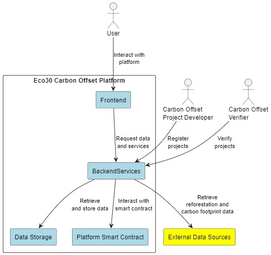
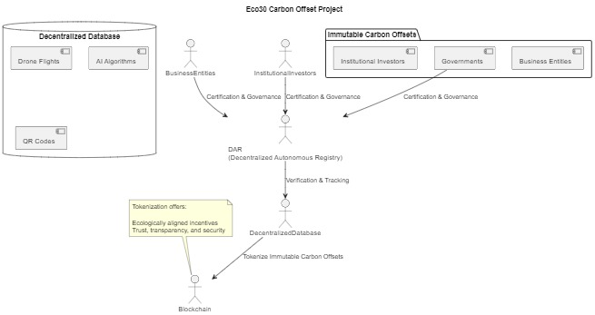

# Eco30 Carbon Offset


Introduction

By developing a decentralized protocol for carbon offset registration and ecological regeneration, we at Immutable Carbon Offsets seek to prevent greenwashing. This occurs when a business misrepresents or gives incorrect information about how environmentally friendly its products are. To trick customers into thinking a company's products are ecologically benign or have a bigger positive environmental impact than they actually do, it may require presenting an unsupported claim. Another kind of greenwashing is when a business highlights a product's sustainability features in an effort to hide its participation in harmful environmental actions.

By 2030, we will have planted 10 billion new trees, helping to meet the world's need for carbon offsets and restoring vital ecosystems. Hence the name Eco30, a pithy way of saying an ecologically safer planet by 2030.



In order to disperse value throughout the ecosystem, our solution incorporates a Decentralized Autonomous Registry (DAR), which oversees the procedure for tracking and verifying carbon offset tokens. Sustainable growth is ensured by the token values' connections to actual initiatives having accountable effects that can be verified. We seek to offer additionality and transparency through blockchain, QR codes, computer vision, autonomous drones, and artificial intelligence.

Our clients are business entities, governments, and institutional investors who support expanding environmental goals. They want a piece of the voluntary carbon offset market, which is anticipated to grow to between $50 and $100 billion by 2030.

The product of immutable carbon offsets is supported by three primary pillars:

1. DAR (Decentralized Autonomous Registry) for certification and governance
2. A decentralized database driven by drone flights, AI algorithms, and QR codes
3. On the blockchain, tokenize immutable carbon offsets.

Our tokenization offers all players incentives that are ecologically aligned as well as having the requisite trust, transparency, and security. Eventually, we plan to broaden its reach to additional nations and different stages of carbon removal, like coral reefs and ocean rejuvenation. The first starting point is Costa Rica.

Prior to the Initial Decentralized Exchange Offering (IDO), we are looking for $3 million in pre-seed equity capital.



```js
echo "# eco30" >> README.md
git init
git add README.md
git commit -m "V1"
git branch -M main
git remote add origin https://github.com/suvrotica/eco30.git
git push -u origin main
git config --global user.email "117360356+suvrotica@users.noreply.github.com"
git init
git add .
git commit -m "v1:Just Initialized With Empty package.json"
git push --set-upstream https://github.com/suvrotica/eco30.git master
```

```bash
Remove-Item -Recurse -Force .
```

## Framework SvelteKit

___

Svelte and SvelteKit are related but serve different purposes within the web development ecosystem. Let's briefly discuss each to understand their differences and why SvelteKit may be more suitable for the Eco30 project.

Svelte:  
Svelte is a modern frontend framework for building web applications. Unlike other popular frameworks like React or Vue, Svelte is a compiler that turns your components into highly efficient, imperative JavaScript code at build time. This results in smaller bundle sizes and better runtime performance. Svelte allows you to write components using a unique syntax that combines HTML, CSS, and JavaScript. Svelte components are reactive by design, leading to a more intuitive way of managing state and building user interfaces.

SvelteKit:  
SvelteKit is a framework built on top of Svelte that provides a complete solution for building web applications. It extends the capabilities of Svelte by offering a unified project structure, server-side rendering (SSR), static site generation (SSG), and other essential features for building full-featured web applications. SvelteKit is built on Vite, a fast build tool and development server, providing an excellent development experience. SvelteKit also includes a built-in adapter system for deploying applications to various hosting platforms with minimal configuration.

Why use SvelteKit for the Eco30 project:

SvelteKit offers several advantages over using Svelte alone, making it a better fit for the Eco30 project:

1. Unified project structure: SvelteKit provides a consistent project structure that simplifies the organization of components, routes, and other resources, leading to a more maintainable codebase.
2. Server-side rendering (SSR) and static site generation (SSG): SvelteKit enables SSR and SSG out of the box, improving the performance and search engine optimization (SEO) of your web application.
3. Built-in development server and build system: SvelteKit comes with Vite, a fast build tool and development server, offering features like hot module replacement (HMR) for a smooth development experience.
4. Simplified deployment: With its adapter system, SvelteKit makes deploying your application to various hosting platforms easy and straightforward.
5. Extensibility: SvelteKit allows for easy integration with other tools, libraries, and APIs, making it a flexible choice for building the Eco30 project.

## Sveltekit Development Ecosystem

___

Vite and Vercel are two different tools, each serving different purposes in the web development ecosystem. When it comes to SvelteKit, they can be used in combination to facilitate development and deployment processes. Let's discuss each of them briefly to understand their differences.

Vite:  
Vite is a build tool and development server created by Evan You, the creator of Vue.js. Vite aims to provide a fast development experience by leveraging native ES modules in modern browsers. It allows for fast, lightweight development with features like hot module replacement (HMR) and fast build times. Vite can be used with various frontend frameworks, including Svelte and SvelteKit.

In the context of SvelteKit, Vite is used as the underlying build tool and development server, providing a fast and smooth development experience. It allows developers to quickly start a local development environment, see their changes in real-time, and build their SvelteKit applications for production.

Vercel:  
Vercel is a cloud platform designed for frontend and serverless deployment. It provides a seamless deployment experience for frontend applications and serverless functions, allowing developers to deploy their projects quickly and easily. Vercel offers various features such as continuous deployment, automatic SSL certificates, and a global content delivery network (CDN).

When using SvelteKit, you can choose Vercel as your deployment platform. Vercel can automatically detect and configure SvelteKit applications, making the deployment process straightforward. By deploying your SvelteKit application on Vercel, you can take advantage of their platform features and ensure fast and reliable delivery of your application to users worldwide.

```bash
npm create svelte@latest web2
cd web2
npm install
npm run dev -- -- dev

npm install marked
MyMarkdown.svelte


npm install --save @fontsource/poppins
```
