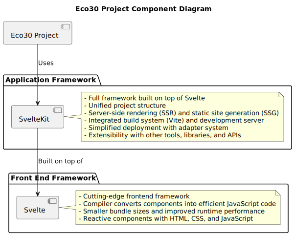

## Svelte and SvelteKit

As a pair, throughout the web development ecosystem, although they have separate functions despite being related. Let's briefly go over each in order to see how they differ and why SvelteKit might be more suited for the Eco30 project.

## Svelte

A cutting-edge frontend framework for creating web applications is called Svelte. Svelte is a compiler that converts your components into extremely efficient, imperative JavaScript code at build time, unlike other well-known frameworks like React or Vue. Smaller bundle sizes and improved runtime performance are the effects of this. You may create components with Svelte using a special syntax that blends HTML, CSS, and JavaScript. Because svelte components are reactive by nature, managing state and creating user interfaces is done in a more natural way.

## Sveltekit

A full framework for developing web apps, SvelteKit is developed on top of Svelte. By providing a uniform project structure, server-side rendering (SSR), static site generation (SSG), and other necessary elements for creating fully functional online applications, it expands the possibilities of Svelte. Vite, a quick build tool and development server that offers a top-notch work environment, serves as the foundation for SvelteKit. Additionally, SvelteKit has an integrated adapter system for quickly deploying apps to a variety of hosting platforms.

## Why use SvelteKit for Eco30

SvelteKit has a number of benefits over utilizing Svelte by itself, which makes it a superior choice for the Eco30 project:

1. Unified project structure: It offers a project structure that makes it easier to sensibly organize everything that can be thrown at it, components, routes, and other resources. This naturally eases the management of a complex an everchanging codebase that interacts with the blockchain with the myriad of fledgling libraries.
2. Server-side rendering (SSR) and static site generation (SSG): SvelteKit allows SSR and SSG out of the box, enhancing the performance and search engine optimization (SEO) of your online application.
3. Integrated build system and development server: SvelteKit includes Vite, a quick build tool with capabilities like hot module replacement (HMR) for a seamless development process.
4. Simplified deployment: SvelteKit's adapter system makes it simple and easy to deploy your application to a variety of hosting platforms.
5. Extensibility: SvelteKit is a flexible option for creating the Eco30 project since it provides for simple interaction with other tools, libraries, and APIs.

