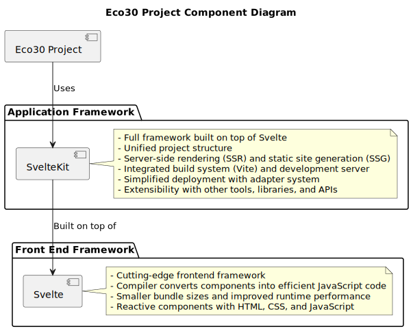

# Technology Stack Selection

Selecting the appropriate technology stack for each component of the system is crucial to ensure performance, scalability, and maintainability. The technology stack should be chosen based on the project requirements, team expertise, and compatibility with other components. This section outlines the technology stack selection process and provides suggested technologies for each component.

## Selection Criteria

The technology stack for each component must be chosen carefully to meet the platform's requirements and ensure compatibility with other components. When selecting a technology stack, consider the following criteria:

-   Performance: The chosen technologies should provide efficient and responsive performance to handle the platform's workload.
-   Scalability: The technology stack should support horizontal and vertical scaling to accommodate future growth.
-   Maintainability: Technologies should be well-documented, widely supported, and have an active community to facilitate long-term maintenance and updates.
-   Compatibility: The chosen technologies should be compatible with other components in the system, ensuring seamless integration and data exchange.
-   port robust security measures and best practices to protect user data and platform resources.

## Selection Process

The selection process for the technology stack should involve the following steps:

-   We define the project requirements: Clearly outline the functional, performance, and security requirements of the platform to guide the technology selection process.
-   We research and evaluate potential technologies: Investigate various technologies for each component, assessing their performance, scalability, maintainability, compatibility, and security.
-   We consult the development team: Gather input from the project team on their expertise and familiarity with potential technologies, as well as any concerns or recommendations.
-   We test and prototype: Test the selected technologies in a prototype or proof-of-concept environment to evaluate their performance, compatibility, and ease of use.
-   We make the final decision: Based on the research, testing, and team input, select the most suitable technology stack for each component.

After completing the selection process, document the chosen technology stack and the rationale for each choice to facilitate future development and maintenance efforts.

## Technologies for Frontend Application

The frontend application is responsible for user interactions and displaying data related to reforestation initiatives and carbon tokens. The chosen technology stack should support a responsive, user-friendly interface and provide seamless communication with the backend API. Some suggested technologies for the frontend application include:

As a pair, throughout the web development ecosystem, although they have separate functions despite being related. Let's briefly go over each in order to see how they differ and why SvelteKit might be more suited for the Eco30 project.

### Svelte

A cutting-edge frontend framework for creating web applications is called Svelte. Svelte is a compiler that converts your components into extremely efficient, imperative JavaScript code at build time, unlike other well-known frameworks like React or Vue. Smaller bundle sizes and improved runtime performance are the effects of this. You may create components with Svelte using a special syntax that blends HTML, CSS, and JavaScript. Because svelte components are reactive by nature, managing state and creating user interfaces is done in a more natural way.

## Sveltekit

A full framework for developing web apps, SvelteKit is developed on top of Svelte. By providing a uniform project structure, server-side rendering (SSR), static site generation (SSG), and other necessary elements for creating fully functional online applications, it expands the possibilities of Svelte. Vite, a quick build tool and development server that offers a top-notch work environment, serves as the foundation for SvelteKit. Additionally, SvelteKit has an integrated adapter system for quickly deploying apps to a variety of hosting platforms.

## Why use SvelteKit for Eco30

SvelteKit has a number of benefits over utilizing Svelte by itself, which makes it a superior choice for the Eco30 project:

-   Unified project structure: It offers a project structure that makes it easier to sensibly organize everything that can be thrown at it, components, routes, and other resources. This naturally eases the management of a complex an everchanging codebase that interacts with the blockchain with the myriad of fledgling libraries.
-   Server-side rendering (SSR) and static site generation (SSG): SvelteKit allows SSR and SSG out of the box, enhancing the performance and search engine optimization (SEO) of your online application.
-   Integrated build system and development server: SvelteKit includes Vite, a quick build tool with capabilities like hot module replacement (HMR) for a seamless development process.
-   Simplified deployment: SvelteKit's adapter system makes it simple and easy to deploy your application to a variety of hosting platforms.
-   Extensibility: SvelteKit is a flexible option for creating the Eco30 project since it provides for simple interaction with other tools, libraries, and APIs.

## Vite:

-   Vite is a build tool and development server that leverages native ES modules for faster development and building.
-   Vite provides fast development experience with features like Hot Module Replacement (HMR), which helps developers see their changes in real-time without a full page reload.
-   Vite supports various plugins and integrations, making it easy to extend its functionality to cater to project-specific needs.

## CSS Framework:

-   PicoCSS is a minimal CSS framework that is lightweight and provides a solid base for styling web applications.
-   Using a CSS framework like PicoCSS can save time on styling and ensure a consistent look and feel across the application.

## Icon Library:

-   The project uses the Iconify library for Svelte, providing a wide range of icons and a simple way to include them in the application.
-   Iconify supports multiple icon sets, making it easy to find suitable icons for the project.

## Markdown and Rendering:

-   The project uses marked for parsing and rendering Markdown, which is a popular and widely used library for this purpose.
-   MDSvex, an extension for Svelte, is used to enable the use of Svelte components within Markdown files, providing a seamless integration of content and interactivity.
-   Rehype-autolink-headings and rehype-slug are used to generate slugs and automatically link headings in the rendered Markdown content, improving the user experience and navigation.

## Typography:

-   The project uses the Poppins font from the Fontsource library, which is a versatile and modern typeface that provides a pleasant reading experience for users.