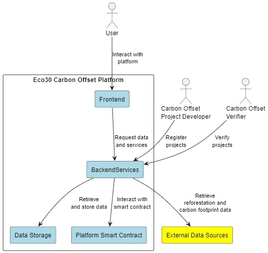

# Eco30 Carbon Offset

## Introduction  

By developing a decentralized protocol for carbon offset registration and ecological regeneration, we at Immutable Carbon Offsets seek to prevent greenwashing. This occurs when a business misrepresents or gives incorrect information about how environmentally friendly its products are. To trick customers into thinking a company's products are ecologically benign or have a bigger positive environmental impact than they actually do, it may require presenting an unsupported claim. Another kind of greenwashing is when a business highlights a product's sustainability features in an effort to hide its participation in harmful environmental actions.  

By 2030, we will have planted 10 billion new trees, helping to meet the world's need for carbon offsets and restoring vital ecosystems. Hence the name Eco30, a pithy way of saying an ecologically safer planet by 2030.
In order to disperse value throughout the ecosystem, our solution incorporates a Decentralized Autonomous Registry (DAR), which oversees the procedure for tracking and verifying carbon offset tokens. Sustainable growth is ensured by the token values' connections to actual initiatives having accountable effects that can be verified. We seek to offer additionality and transparency through blockchain, QR codes, computer vision, autonomous drones, and artificial intelligence.

Our clients are business entities, governments, and institutional investors who support expanding environmental goals. They want a piece of the voluntary carbon offset market, which is anticipated to grow to between $50 and $100 billion by 2030.
The product of immutable carbon offsets is supported by three primary pillars:  

1. DAR (Decentralized Autonomous Registry) for certification and governance
2. A decentralized database driven by drone flights, AI algorithms, and QR codes
3. On the blockchain, tokenize immutable carbon offsets.

Our tokenization offers all players incentives that are ecologically aligned as well as having the requisite trust, transparency, and security. Eventually, we plan to broaden its reach to additional nations and different stages of carbon removal, like coral reefs and ocean rejuvenation. The first starting point is Costa Rica. Prior to the Initial Decentralized Exchange Offering (IDO), we are looking for $3 million in pre-seed equity capital.
