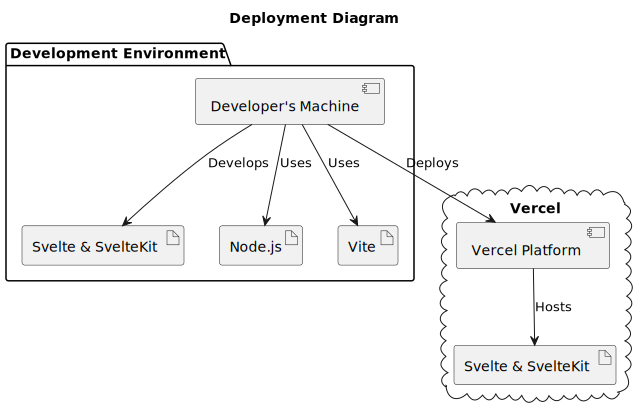

# Development and Hosting

The web development ecosystem utilizes two distinct tools, Vite and Vercel, for reasons that are distinct from one another. They can be combined with SvelteKit to speed up the development and deployment procedures. To grasp the differences between each of them, let's briefly discuss each one.

## Vite

Evan You, the developer of Vue.js, designed Vite as a build tool and development server. Vite uses the native ES modules found in contemporary browsers to deliver a quick programming experience. It provides for fast, lightweight development with capabilities like hot module replacement (HMR) and fast build times. Svelte and SvelteKit are two frontend frameworks that can be used with Vite.
Vite is utilized as the foundational build tool and development server in the context of SvelteKit, offering a quick and easy development experience. It allows developers to easily create a local development environment, examine their changes in real-time, and build their SvelteKit applications for production.

## Vercel

A cloud platform called Vercel is made for serverless and frontend deployment. It offers frontend applications and serverless operations a smooth deployment experience, enabling developers to launch their projects fast and easily. Vercel offers many services such as continuous deployment, automated SSL certificates, and a worldwide content delivery network (CDN).
You can select Vercel as your deployment platform while using SvelteKit. Vercel can automatically recognize and configure SvelteKit applications, making the deployment process straightforward. By deploying your SvelteKit application on Vercel, you can take advantage of their platform features and assure fast and dependable delivery of your application to users globally.



``` javascript
@startuml hosting

title Deployment Diagram

!define NODE "Node.js"
!define VITE "Vite"
!define VERCEL "Vercel"

package "Development Environment" {
  [Developer's Machine]
  artifact "Svelte & SvelteKit" as SvelteKit
  artifact NODE as NodeJS
  artifact VITE as Vite
}

cloud "Vercel" {
  [Vercel Platform]
  artifact "Svelte & SvelteKit" as DeployedSvelteKit
}

[Developer's Machine] --> SvelteKit : Develops
[Developer's Machine] --> NodeJS : Uses
[Developer's Machine] --> Vite : Uses

[Developer's Machine] -down-> [Vercel Platform] : Deploys
[Vercel Platform] --> DeployedSvelteKit : Hosts

@enduml
```
