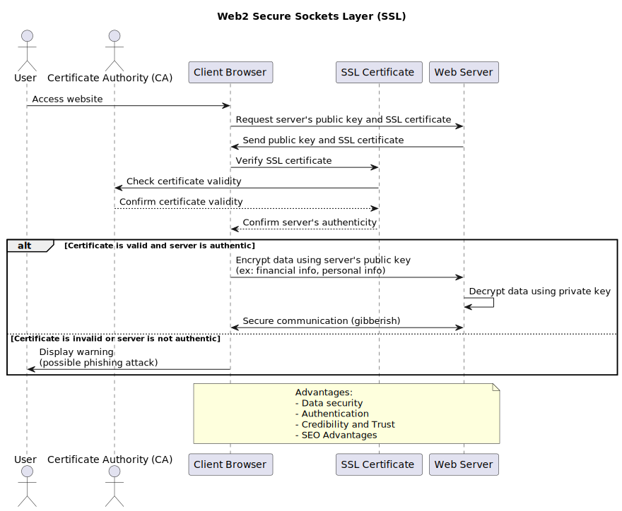

# Layers of Security

## Web2 Secure Sockets Layer (SSL)

A web server and a client browser can talk in gibberish thanks to the security protocol known as SSL. For this carbon token project, implementing SSL has a number of advantages that improve the platform's security and dependability. Here are several use scenarios showcasing the advantages of SSL:

1. Data security: SSL's main purpose is to safeguard data in transit between a user's browser and a web server. Users of this initiative will exchange financial and personal information, including credit card numbers, in order to buy carbon tokens. By ensuring that this data is shielded from malicious outsiders, SSL helps to stop data theft and unauthorized access.

2. Authentication: SSL certificates offer authentication, making sure the user connects to the correct server. This lowers the danger of phishing attacks and other scams for the carbon token project since consumers can be sure they are interacting with the genuine platform rather than a dishonest imitation.

3. Credibility and Trust: Certificate Authorities (CAs) normally issue SSL certificates after confirming the legitimacy of the website owner. When a platform displays a valid SSL certificate, typically denoted by a padlock icon and "https" in the URL bar, it informs users that it is secure and reliable. Building trust with users is essential for the carbon token project because they are more willing to invest in a platform they feel is reliable and secure.

4. SEO Advantages: Search engines like Google give SSL-certified websites a higher rating in their search results. Having an SSL certificate will help the carbon token project's search engine ranking, increasing its visibility to potential users and generating organic traffic for the platform.



``` bash
@startuml ssl
title Web2 Secure Sockets Layer (SSL)

actor User
actor "Certificate Authority (CA)" as CA

participant "Client Browser" as Client
participant "SSL Certificate" as Certificate
participant "Web Server" as Server

User -> Client: Access website
Client -> Server: Request server's public key and SSL certificate
Server -> Client: Send public key and SSL certificate
Client -> Certificate: Verify SSL certificate
Certificate -> CA: Check certificate validity
CA --> Certificate: Confirm certificate validity
Certificate --> Client: Confirm server's authenticity

alt Certificate is valid and server is authentic
Client -> Server: Encrypt data using server's public key\n(ex: financial info, personal info)
Server -> Server: Decrypt data using private key
Client <-> Server: Secure communication (gibberish)
else Certificate is invalid or server is not authentic
Client -> User: Display warning\n(possible phishing attack)
end

note over Client, Server
Advantages:
- Data security
- Authentication
- Credibility and Trust
- SEO Advantages
end note

@enduml


```
